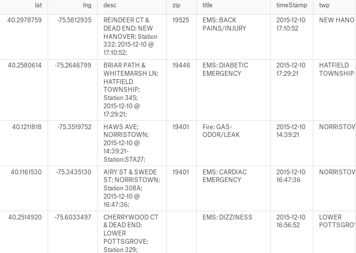

## The Dataset

The data consists in 266543 call records in the Montgomery County, Pennsylvania, USA that occured between the 10/12/2015 and the 11/03/2017

**Source:** [Emergency - 911 Calls]( https://www.kaggle.com/mchirico/montcoalert)

## Overview
<table border="0">
  <tr>
    <td>
      
    </td>
  </tr>
  <tr>
    <td>
      Overview
    </td>
  </tr>
</table>

Each call is in particularly described by:
* Its geographical coordinates
* Its date and time
* Its category (among Fire, EMS, Traffic)
* Its subcategory (the part after ':' of the category column)

