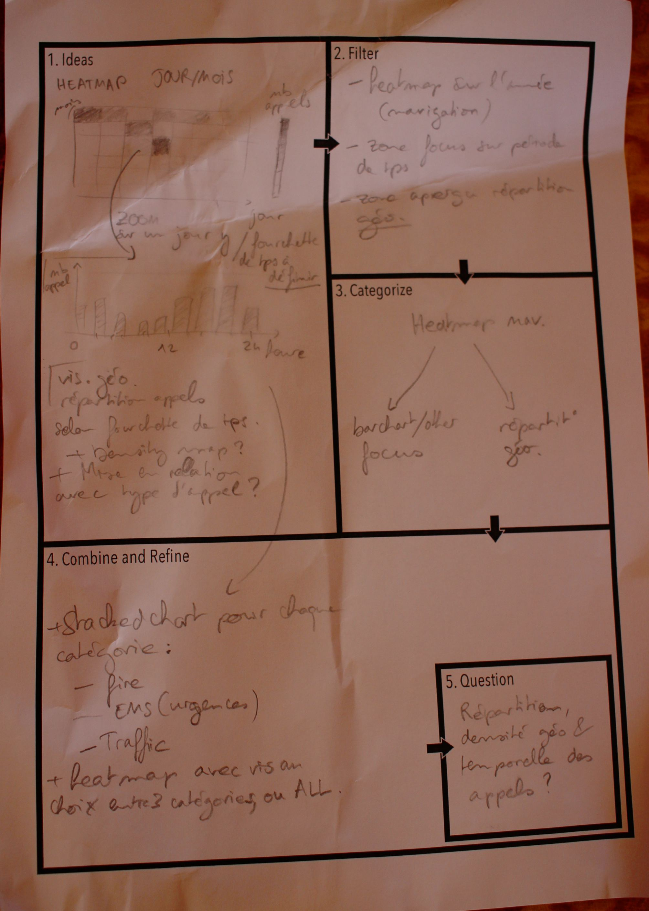
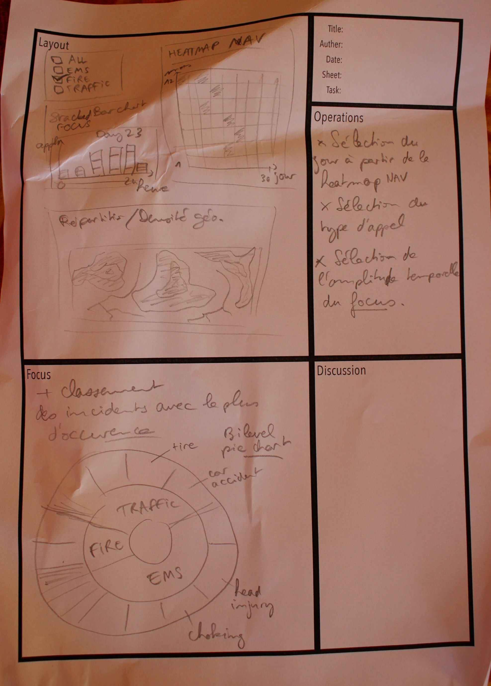
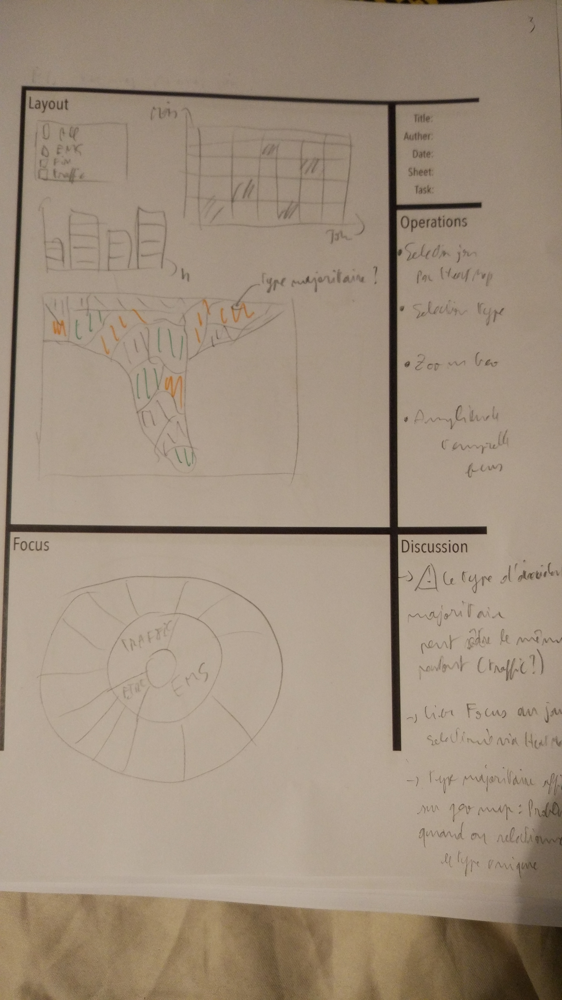
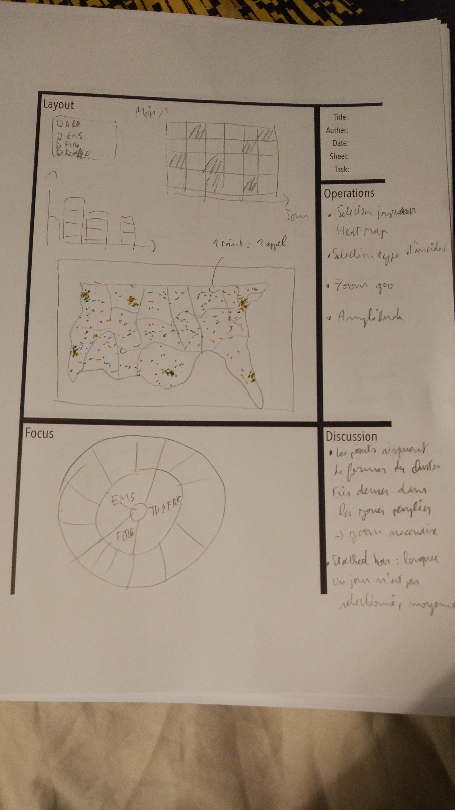
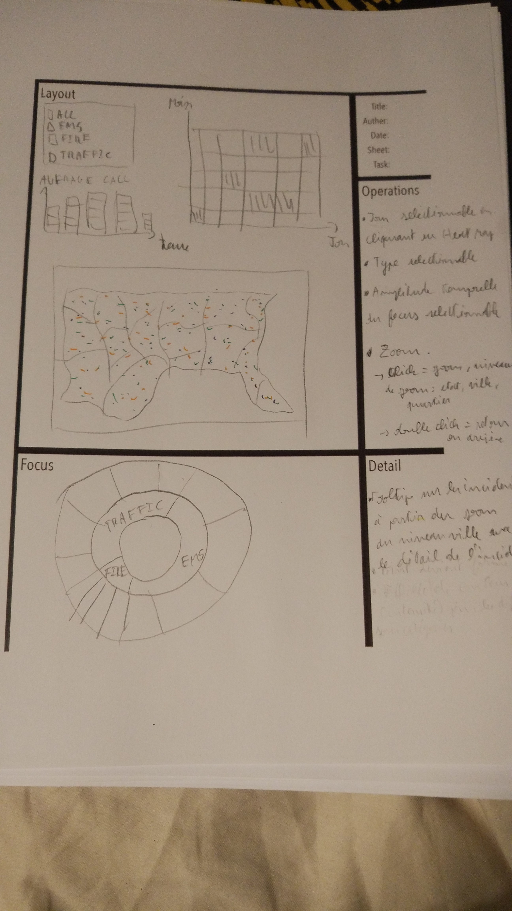

# 911 calls data visualization

## First sheet

La première feuille de design nous permet de proposer une visualisation de la densité des appels sous forme de heat map en fonction du jour et du mois.

Nous pouvons affiner cette vue en proposant un stacked bar chart donnant le détail des types d'urgences par heure, à partir d'un jour sélectionné sur la heat map

Il sera aussi possible de se limiter à un seul type d'incident.

<table border="0">
  <tr>
    <td>
      
    </td>
  </tr>
  <tr>
    <td>
      First design sheet
    </td>
  </tr>
</table>

## Second design sheet

Cette première vue passe à côté d'un aspect important de ce jeu de données: la répartition géographique. Nous intégrerons donc une carte choroplèthe qui donne par état, le type d'incident majoritaire (Fire/EMS/Traffic)

Le focus permettre d'accéder aux sous catégories majoritaires pour chaque type d'incident grâce à un pie chart à deux niveaux.

<table border="0">
  <tr>
    <td>
      
    </td>
  </tr>
  <tr>
    <td>
      Second design sheet
    </td>
  </tr>
</table>

Si cette carte donne un bon aperçu de la répartition temporelle, nous pouvons cependant affiner la représentation géographique de notre jeu de données.

## Third design sheet

<table border="0">
  <tr>
    <td>
      
    </td>
  </tr>
  <tr>
    <td>
      Second design sheet
    </td>
  </tr>
</table>

## Fourth design sheet

<table border="0">
  <tr>
    <td>
      
    </td>
  </tr>
  <tr>
    <td>
      Second design sheet
    </td>
  </tr>
</table>

## Fith design sheet

<table border="0">
  <tr>
    <td>
      
    </td>
  </tr>
  <tr>
    <td>
      Second design sheet
    </td>
  </tr>
</table>
