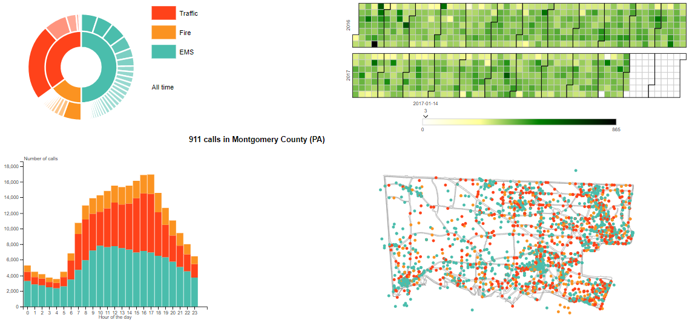
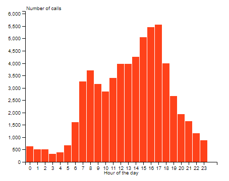

## About 911Vis

This project is the final group project for the lesson '[Interactive Data Visualization](https://github.com/LyonDataViz/MOS5.5-Dataviz)' at the Ecole Centrale Lyon (2018). The goal of this project is to build an interactive visualization tool in [D3.js](https://d3js.org/) allowing to explore and highlight interesting properties of a dataset. 

The authors of this project choosed to explore the [Emergency - 911 Calls]( https://www.kaggle.com/mchirico/montcoalert) available on Kaggle, recording more than 260 000 emergency calls in the Montgomery county (PA, USA) between 2015 and 2017. Details are available in [DATA.md](https://github.com/RenonDis/911Vis/blob/master/DATA.md).

   

Montgomery county, PA 

     

**[Click here to see the final result](https://renondis.github.io/)** (it might take up to 10s to load)

Authors : [Florentin Vallee](https://github.com/RenonDis), [Alexis Collette](https://github.com/AlxClt), [Anouar Mechti]()

 

## The 911Vis

The 911Vis tool allows you to explore the call distribution in time, space and by category. There are four main visualisations, all linked together.
 

   

 The beautiful 911Viz! 

 

### The Heatmap

The heat map shows the density of calls per day. The darker it gets, the more 911 has been called!

  

The slider down the heatmap gives you the exact number of calls when you hover a day. 

  

You can select a particular day by clicking it on the heatmap. The other visualisations will be then instantly updated! To goback to the all time visualisation, just click the 'reset' button. 

### The sunburst

The sunburst shows the categorical distribution of the calls. Initially, you can see at the first level the three main categories. At the second level, you can see the subcategories fading out as they become less frequent. The tooltip you can see on the following figure appears when you hover the sunburst :

  

By clicking either on a category or a subcategory, you can filter the visualisation so that you see only the selected items :

  

If you click again on the category/subcategory, you undo the filtering. 

### The stacked bar chart

The stacked bar chart focuses on the daily call repartition. It shows by hoursthe average number of callsforeach category. 

  

The stacked bar chart is not clickable, however if you filter the visualisation thanks to the sunburst or the heatmap, the bar chart will be updated:

  

Note that when you select a category on the sunburst, the color scale of the stacked bar chart will be the same than for the sunburst.

### The map

The map shows the geographical repartition of the calls. Note that if there is more than 3000 calls in the selection, the map only displays 3000 randomly selected calls.

  

You can zoom on the map by clicking on it. Once it is zoomed, you can move by clicking on a non centered part of the map. Double click or press the reset button to zoomout! 

## Interesting facts

Let's explore the viz! We will show you some iteresting insight one can draw out of this too

### Patterns

The stacked bar chart is a great tool to spot event patters during the day. We grouped for you some funny/intereting patterns in the following table :

<table border="0">
  <tr>
    <td>
      
 Traffic: Vehicle Accident 

      
    </td>
    <td>
      
 Fire: Woods/Fields Fire 

      
    </td>
    <td>
      
 EMS: Syncopal Episode 

      
    </td>
    <td>
      
 EMS: Assault Victim 

      
    </td>
  </tr>
</table>

These patterns are quite informative:
* Traffic accidents occurs more at rush hours
* Woods and fields fire occurs more around 3pm, when the heat is at its highest.
* People tend to pass out more in the morning!
* There are higher chances to be assaulted at night

### Anomalies

Another interesting use of this tool is the detection of unusual patterns.

If you filter the visualisation on 'Traffic: DISABLED VEHICLE' you will see on the heatmap that most of the calls occured on the 23rd of January, 2016 :

  

On the map, you can see that it occured all along the County. Why this particular day? A quick research on the web outputs that a [huge blizzard hit the USA on that day](https://en.wikipedia.org/wiki/January_2016_United_States_blizzard), whis is the origin of this anomaly.

Still in the 'Traffic' category, if you filter to ROAD OBSTRUCTION, you see the same kind of anomaly for the 3rd of April, 2016:

  

This anomaly has been caused by a [storm hitting the state on that day](https://www.nbcphiladelphia.com/weather/stories/Powerful-Wind-Watch-Warning-Philadelphia-South-Jersey-Delaware-Pennsylvania-Power-Outages-Damage-374375501).

## Video presentation
